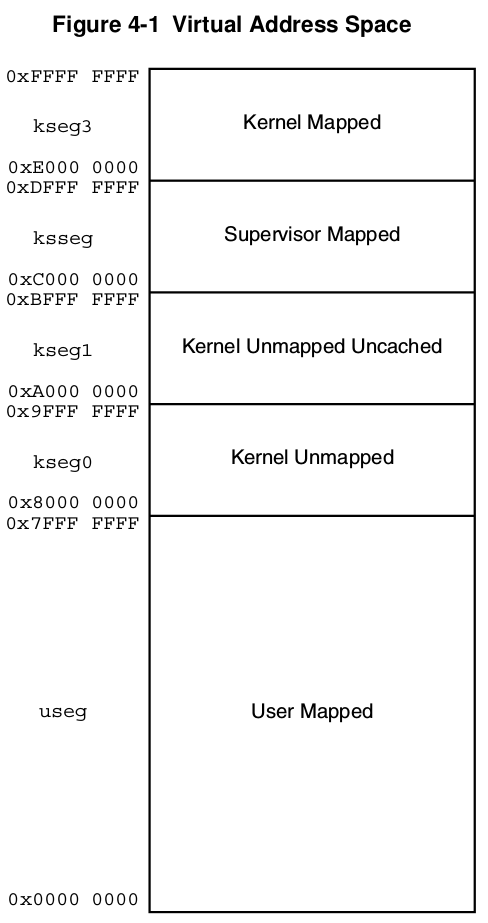
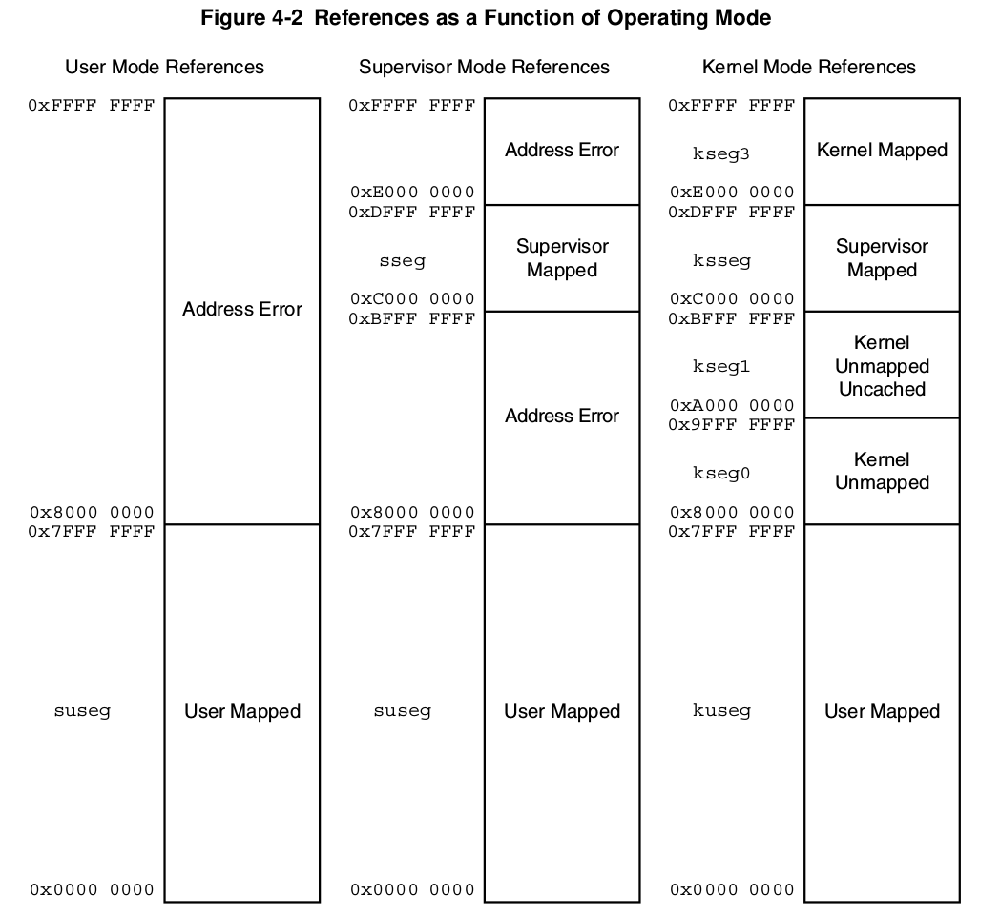

<!-- TOC -->

- [MIPS](#mips)
    - [CP0](#cp0)
    - [大小端](#大小端)
    - [nop ssnop](#nop-ssnop)
    - [sync synci](#sync-synci)
    - [MIPS32 and microMIPS32 Operating Modes](#mips32-and-micromips32-operating-modes)
    - [Virtual Memory](#virtual-memory)
        - [Context Register](#context-register)
        - [MIPS虚拟地址空间](#mips虚拟地址空间)
        - [Address Space Identifiers (ASID)](#address-space-identifiers-asid)
        - [Common Device Memory Map](#common-device-memory-map)
            - [CDMM - Access Control and Device Register Blocks](#cdmm---access-control-and-device-register-blocks)
            - [Access Control and Status Registers](#access-control-and-status-registers)
    - [GPR Shadow Registers](#gpr-shadow-registers)
    - [CP0 Hazards](#cp0-hazards)
    - [需要实现的CP0寄存器](#需要实现的cp0寄存器)
    - [需要额外添加的指令](#需要额外添加的指令)
    - [异常处理入口地址](#异常处理入口地址)

<!-- /TOC -->
# MIPS

记录一些附录中提到的关于MIPS体系结构的细节

## CP0

Coprocessor 0 (CP0) is incorporated on the CPU chip and supports the virtual memory system and exception
handling. CP0 is also referred to as the System Control Coprocessor.
CP0 translates virtual addresses into physical addresses, manages exceptions, and handles switches between kernel,
supervisor, and user states. CP0 also controls the cache subsystem, as well as providing diagnostic control and error
recovery facilities. The architectural features of CP0 are defined in Volume III.

## 大小端

MIPS bit designations are always little-endian

## nop ssnop

nop   = sll $0,$0,0
ssnop = sll $0,$0,1
实际上不用进行特别译码,当做sll指令即可,都不会对结果产生影响

## sync synci

Format:SYNC (stype = 0 implied)
       SYNC stype
Purpose: To order loads and stores for shared memory.
[稍微介绍了synci](http://ju.outofmemory.cn/entry/64498)
>应该是涉及到多线程的时候才需要

## MIPS32 and microMIPS32 Operating Modes

关于代码运行的模式,MIPS分为Debug Mode,Kernel Mode,Supervisor Mode,User Mode和Other Mode,大概是通过修改CP0寄存器的某些位的值来实现各个模式之间的区别,同时各个模式之间的权限也不一样.
>详情见附录3 19页

## Virtual Memory

>详情见附录3 23页

### Context Register

CP0寄存器,可以用于指向PTE(页表的起始地址)

### MIPS虚拟地址空间

[MIPS32地址分布](https://zhidao.baidu.com/question/746375837545398092.html)

### Address Space Identifiers (ASID)

>TLB部分见文档29页

The TLB-based translation mechanism supports Address Space Identifiers to uniquely identify the same virtual address across different processes. The operating system assigns ASIDs to each process and the TLB keeps track of the ASID when doing address translation. In certain circumstances, the operating system may wish to associate the same virtual address with all processes. To address this need, the TLB includes a global (G) bit which over-rides the ASID comparison during translation.
>基于TLB的转换机制支持地址空间标识符，以跨不同进程唯一标识相同的虚拟地址。 操作系统为每个进程分配ASID，TLB在进行地址转换时跟踪ASID。 在某些情况下，操作系统可能希望将相同的虚拟地址与所有进程相关联。 为了满足这种需要，TLB包括一个全局（G）位，它在转换期间超越了ASID比较。

### Common Device Memory Map

>I/O相关

CDMMBase - A new Coprocessor 0 register that sets the base physical address of the CDMM

#### CDMM - Access Control and Device Register Blocks

Access control information is specified via ‘Access Control and Status Registers’ (ACSRs) that are found at the start of the DRB allocated for the device with the lowest physical address.
>访问控制信息通过在为物理地址最低的设备分配的DRB开始时找到的“访问控制和状态寄存器”（ACSR）指定。

Reading any of the IO device registers in either usermode or supervisor mode when such accesses are not allowed,results in all zeros being returned. Writing any of the IO device registers in either usermode or supervisor mode when such accesses are not allowed, results in the write being ignored and the register not being modified. Reading any of the ACSR registers while not in kernel mode results in all zeros being returned. Writing any of the ACSR registers while not in kernel mode results in the write being ignored and the ACSR not being modified.
>在不允许此类访问时，以usermode或supervisor模式读取任何IO设备寄存器会导致返回所有零。 当不允许这样的访问时，在用户模式或管理程序模式下写入任何IO设备寄存器会导致写入被忽略并且寄存器不被修改。 在未处于内核模式时读取任何ACSR寄存器会导致返回所有零。 在不处于内核模式时写入任何ACSR寄存器会导致写入被忽略且ACSR未被修改。

#### Access Control and Status Registers

The first DRB of a device has 8 bytes of access control address space allocated to it. These 8 bytes can be considered
to be two 32-bit registers (on a 32-bit or 64-bit core), or a single 64-bit register (on a 64-bit core).
>前面提到的DRB是8byte,使用两个32bit的寄存器来实现

In revision 1.00 of the CDMM, only the lower 32-bits hold access control and status information. The control/status register can be accessed in kernel mode only. Reading this register while not in kernel mode results in all zeros being returned. Writing this register while not in kernel mode results in the write being ignored and the register not being modified.
>依旧是权限问题,具体见41页,表5.2

## GPR Shadow Registers

The capability in this chapter is targeted at removing the need to save and restore GPRs on entry to high priority interrupts or exceptions, and to provide specified processor modes with the same capability. This is done by introducing multiple copies of the GPRs, called shadow sets, and allowing privileged software to associate a shadow set with entry to Kernel Mode via an interrupt vector or exception. The normal GPRs are logically considered shadow set zero.
The number of GPR shadow sets is implementation dependent and may range from one (the normal GPRs) to an architectural maximum of 16. The highest number actually implemented is indicated by the SRSCtl HSS field, and all shadow sets between 0 and SRSCtl HSS , inclusive must be implemented. If this field is zero, only the normal GPRs are implemented.
>
本章的功能旨在消除在进入高优先级中断或异常时保存和恢复GPR的需要，并提供具有相同功能的指定处理器模式。 这是通过引入GPR的多个副本（称为影子集）并允许特权软件通过中断向量或异常将影子集与条目关联到内核模式来完成的。 正常的GPR在逻辑上被认为是阴影集零。
GPR影子集的数量取决于实现，其范围可以从一个（正常GPR）到架构最大值16。实际实现的最高数量由SRSCtl HSS字段指示，并且所有影子集在0和SRSCtl HSS之间，包括0和SRSCtl HSS。 必须实施。 如果该字段为零，则仅实现正常的GPR。
(不知道是否有用,跳过)

## CP0 Hazards

Because resources controlled via Coprocessor 0 affect the operation of various pipeline stages of a MIPS32/microMIPS32 processor, manipulation of these resources may produce results that are not detectable by subsequent instructions for some number of execution cycles. When no hardware interlock exists between one instruc-
tion that causes an effect that is visible to a second instruction, a CP0 hazard exists.
In Release 1 of the MIPS32® Architecture, CP0 hazards were relegated to implementation-dependent cycle-based
solutions, primarily based on the SSNOP instruction. Since that time, it has become clear that this is an insufficient and error-prone practice that must be addressed with a firm compact between hardware and software. As such, new instructions have been added to Release 2 of the architecture which act as explicit barriers that eliminate hazards. To the extent that it was possible to do so, the new instructions have been added in such a way that they are backward-compatible with existing MIPS processors.
>由于通过协处理器0控制的资源会影响MIPS32 / microMIPS32处理器的各种流水线级的操作，因此对这些资源的操作可能会产生后续指令无法在一定数量的执行周期中检测到的结果。当一个指令之间不存在硬件互锁时
如果导致第二条指令可见的效果，则存在CP0危险。
在MIPS32®架构的第1版中，CP0危害被降级为依赖于实现的循环
解决方案，主要基于SSNOP指令。从那时起，很明显这是一个不充分且容易出错的做法，必须通过硬件和软件之间的紧密结合来解决。因此，在架构的第2版中添加了新的指令，这些指令充当消除危险的明确障碍。在可能的范围内，新指令的添加方式使它们与现有的MIPS处理器向后兼容。
(暂时跳过,到时候出现问题再回头来看)

## 需要实现的CP0寄存器

>具体细节后期查表,85页

|Name    |Function|
| ------ | ------ |
|Index |Index into the TLB array|
|Random |Randomly generated index into the TLB array|
|EntryLo0 |Low-order portion of the TLB entry for even-numbered |virtual pages|
|Context |Pointer to page table entry in memory|
|PageMask |Control for variable page size in TLB entries|
|Wired |Controls the number of fixed (“wired”) TLB entries|
|EntryHi |High-order portion of the TLB entry|
|Config1|Configuration register 1|
|TagLo|Low-order portion of cache tag interface|
|TagHi|High-order portion of cache tag interface|
|ErrorEPC|Program counter at last error|
|EBase|Exception vector base register|

**TLB相关的CP0寄存器**
Index &emsp;&emsp;(硬件读取TLB的索引）
EntryLo0（要写入的偶数物理页的页号）
EntryLo1（要写入的奇数物理页的页号）
EntryHi &ensp;（要写入TLB的虚页号）
>西北工业大学2队还加入了Config2,PRId(Processor identification and revision)

清华大学CP0寄存器

## 需要额外添加的指令

|Mnemonic|Instruction|
| ------ | ------ |
|PREF|prefetch|
|TLBP|Probe TLB for Matching Entry|
|TLBR|Read Indexed TLB Entry|
|TLBWI|Write Indexed TLB Entry|
|TLBWR|Write Random TLB Entry|

西北工业大学新增的指令

北京科技大学新增的指令

清华大学指令

## 异常处理入口地址

按照MIPS手册规范异常入口地址
>到时候查手册
